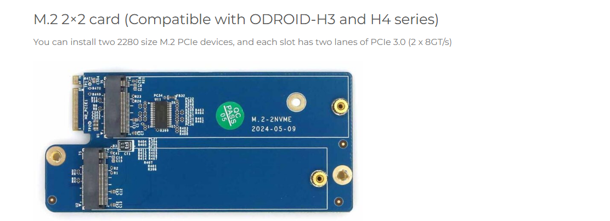

# sbc-dev

## Requirement 1:  Instal M2 Card and Expand the Storage

Single Board Computer - SBC X86, ARM  
## Empty Card

## Card with Installed SSD Expended Storage

### After installing M2 Card on SBC

More Information can be found on Below link
[Instal M2 Card and Expand the Storage](odroid-h3-plus/readme.md)  

## Requirement 2: Evaluate Lenova Laptop to check if meets Spoorthi requirements
 Install Engineering Tools that are required to test and verify if the Laptop is suffice to work with all the required engineering tools.

## Request 3: Connect Rasberrypi on Ipad- new and old ipads.

New IPad as USB C and old Ipads has Apple Lightenting Port.

On the - we will either installing casaos or VS Code Server. 
This server will help users to connect over browser and can coding on vscode platform.

Now RPI will come with its own SSD Storage and its own wifi

I need to my the below board and install ssd and setup the environment and should be host and test using ipad connectivity.
https://www.waveshare.com/product/raspberry-pi/boards-kits/cm5/cm5-io-base-b.htm

Now we connect connect over wifi. Instead if we can connect over USBA to USB C or USBA to Ligtenning port via Cable, we will have stable connection between Pi board and Ipad.

That is what we need to test 
The above Boad comes with Two USB, HDMI, Ethernet Card which are not required, since we are directly connecting to IPAD Iterface.
Or how we can use Display port and make default display on IPAD is the key.

For old IPADS which are no more in use, users should be able to connect to RPI Directly. The question is how to achive it.

