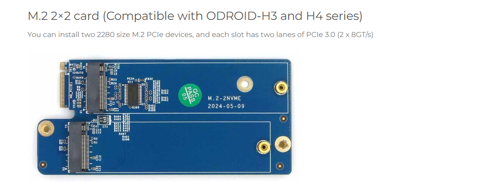

https://www.hardkernel.com/shop/odroid-h3-plus/

H3-plus is a Single Board Computer based on x86 Architecture.

It comes with only one SSD. Now  

Now odroid-h3 plus will come only with only one SSD Card. now they have given option one SSD into dual SSD for which they provided instructions at below page.

https://www.hardkernel.com/shop/m-2-2x2-card/

using the above card, once can expand the storage. 

Requirement, I bough the card, need help to update the Bios and install the card and expand the storage.

